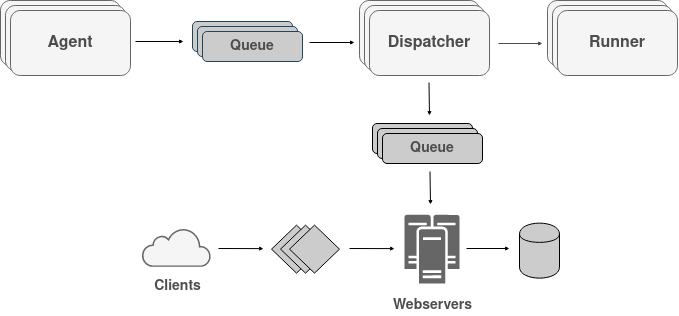

Narwhal
=======

PoC of a very simple CI system consists of 3 microservices:

- **Agent:** It's the watcher process, ideally it should subscribe to remote
  repositories (e.g. webhooks on github) waiting for new events to be
  dispatched to the workers asynchronously through a middleware, for example a
  RabbitMQ task-queue.

- **Dispatcher:** a simple RESTful server, responsible for load-balancing CI
  jobs to a pool of workers (runner) through RPC (currently using built-in
  `net/rpc` package, `gRPC` would probably be a better solution for production)
  and collecting some useful stats by monitoring their state. Exposes some APIs
  to get the job's related infos or to force some re-submit.

- **Runner:** Orchestrate received jobs safely inside an isolated environment
  by creating containers on-the-go.

### Rationale

Simple project in Go, actually made to learn the language as it offers a lot of
space for improvements and incremental addition of features.

Ideally a bunch of runners should be spread on a peer’s subnet with similar hw
and each one registers itself to the dispatcher. Beside registering itself,
another way could very well be to use a load-balancer or a proxy, registering
it’s URL to the dispatcher and demanding the job distributions to it.

### Draft architecture

`Agent` microservice is responsible for subscribing to VC's event notification
system (for now supporting just GitHub), forwarding every new commit not
already in processing to a `RabbitMQ` commit queue.

`Dispatcher` microservices is responsible for receiving the commit jobs from
the queue and forward it to the best `Runner` according to different heuristics
(could be also handled by a load-balancer and let him do the balancing). This
microservice is also responsible for continous monitoring of the runners
through RPC and communicating metrics to another `RabbitMQ` toward a backend
dedicated webserver (hypotethically the main entry point for a front-end
application, with also websockets and so on).

`Runner` is the process responsible for cloning of the repository and running
the process listed in the narwhal.yml file, ideally in docker containers.

